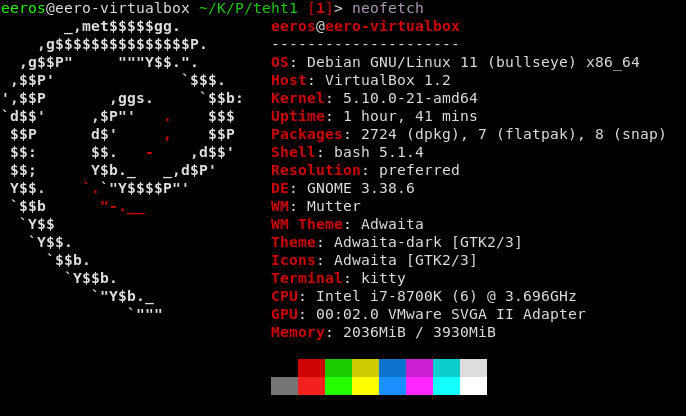
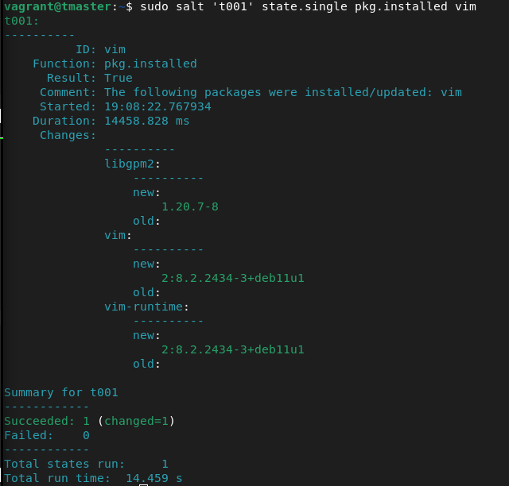
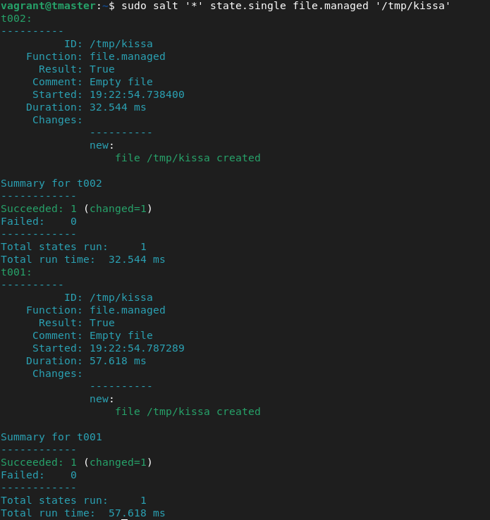
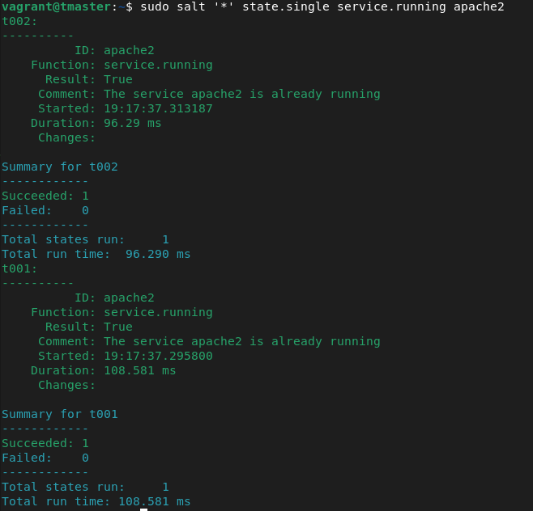
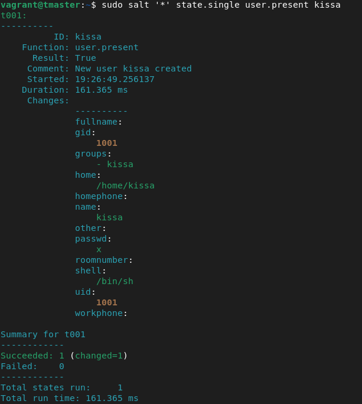
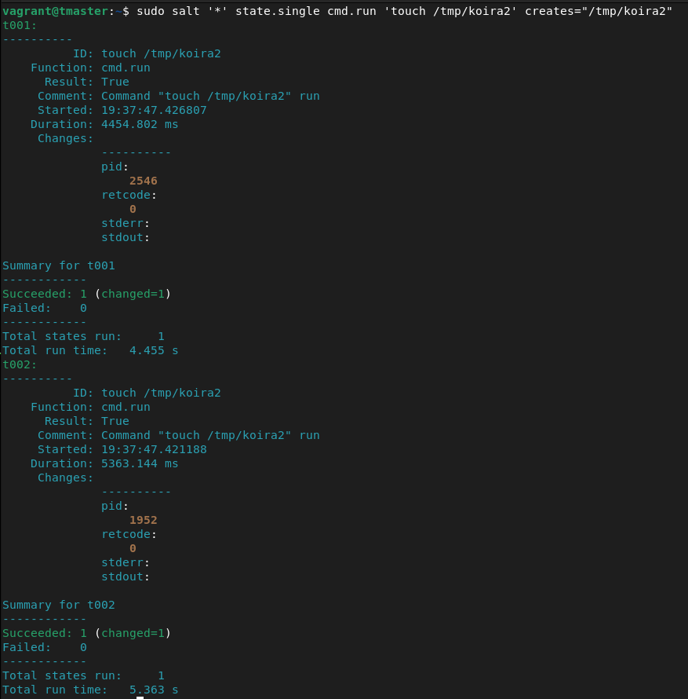
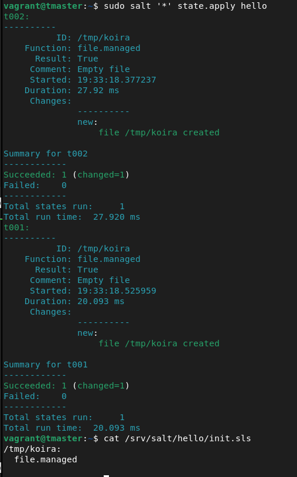

# h1 Suolaa

# x)

## [web page using github](https://terokarvinen.com/2023/create-a-web-page-using-github/) tiivistelmä

- tee repository githubiin
- laita description 
- valitse lisenssi tehdessä
- markdown tiedostot hyviä
- paras päivä julkaista on eilen ja toisiksi paras tänään.

## [salt-vagrant](https://terokarvinen.com/2023/salt-vagrant/) tiivistelmä

- install:  

		sudo apt-get update
		sudo apt-get -y install virtualbox vagrant micro
		
		mkdir saltdemo; cd saltdemo
		micro Vagrantfile

- kopioi valmiiksi tehty vagrantfile

- vagrant up ajaa vagrantfilen

- vagrant ssh tmaster - kirjautuu master tietokoneelle

- kun tmasterin sisällä:

		sudo salt-key -A
		The following keys are going to be accepted:
		Unaccepted Keys:
		t001
		t002
		Proceed? [n/Y] y
		Key for minion t001 accepted.
		Key for minion t002 accepted.

- testi:

	sudo salt '*' test.ping

- sudo salt '*' kun haluaa tehdä komennon kaikille.

- shellikomennot:

	cmd.run 'hostname -I'

- informaation keräys:

	grains.items
	grains.item osfinger ipv4

- idempotentti kuvaa tavoitetilaa

- lopetettaessa:
		exit
		vagrant destroy	# destroys all files in all three virtual computers

ympäristö:


tein uuden hakemiston ja lisäsin sinne Vagrantfile nimisen tekstitiedoston johon kopioin tiivistelmän artikkelista koodin.
```
	mkdir teht1
	micro Vagrantfile
	cat Vagrantfile
	
	$minion = <<MINION
	sudo apt-get update
	sudo apt-get -qy install salt-minion
	echo "master: 192.168.12.3">/etc/salt/minion
	sudo service salt-minion restart
	echo "See also: https://terokarvinen.com/2023/salt-vagrant/"
	MINION
	
	$master = <<MASTER
	sudo apt-get update
	sudo apt-get -qy install salt-master
	echo "See also: https://terokarvinen.com/2023/salt-vagrant/"
	MASTER
	
	Vagrant.configure("2") do |config|
		config.vm.box = "debian/bullseye64"
	
		config.vm.define "t001" do |t001|
			t001.vm.provision :shell, inline: $minion
			t001.vm.network "private_network", ip: "192.168.12.100"
			t001.vm.hostname = "t001"
		end
	
		config.vm.define "t002" do |t002|
			t002.vm.provision :shell, inline: $minion
			t002.vm.network "private_network", ip: "192.168.12.102"
			t002.vm.hostname = "t002"
		end
	
		config.vm.define "tmaster", primary: true do |tmaster|
			tmaster.vm.provision :shell, inline: $master
			tmaster.vm.network "private_network", ip: "192.168.12.3"
			tmaster.vm.hostname = "tmaster"
		end
	end
```

kokeilin ajaa `vagrant up` ja sain paljon virheilmoituksia joissa mainittiin libvirt

		eeros@eero-virtualbox ~/K/P/teht1 [1]> vagrant up
		Bringing machine 't001' up with 'libvirt' provider...
		Bringing machine 't002' up with 'libvirt' provider...
		Bringing machine 'tmaster' up with 'libvirt' provider...
		==> tmaster: An error occurred. The error will be shown after all tasks complete.
		==> t002: An error occurred. The error will be shown after all tasks complete.
		==> t001: An error occurred. The error will be shown after all tasks complete.
		An error occurred while executing multiple actions in parallel.
		Any errors that occurred are shown below.
		
		An error occurred while executing the action on the 't001'
		machine. Please handle this error then try again:
		
		Error while connecting to Libvirt: Error making a connection to libvirt URI qemu:///system?no_verify=1&keyfile=/home/eeros/.ssh/id_rsa:
		Call to virConnectOpen failed: Failed to connect socket to '/var/run/libvirt/libvirt-sock': No such file or directory
		
		An error occurred while executing the action on the 't002'
		machine. Please handle this error then try again:
		
		Error while connecting to Libvirt: Error making a connection to libvirt URI qemu:///system?no_verify=1&keyfile=/home/eeros/.ssh/id_rsa:
		Call to virConnectOpen failed: Failed to connect socket to '/var/run/libvirt/libvirt-sock': No such file or directory
		
		An error occurred while executing the action on the 'tmaster'
		machine. Please handle this error then try again:
		
		Error while connecting to Libvirt: Error making a connection to libvirt URI qemu:///system?no_verify=1&keyfile=/home/eeros/.ssh/id_rsa:
		Call to virConnectOpen failed: Failed to connect socket to '/var/run/libvirt/libvirt-sock': No such file or directory

kokeilin asentaa vagrantin uudestaan vagrantin omien asennusohjeiden mukaan.

		sudo apt autoremove
		sudo apt --purge remove vagrant

		wget -O- https://apt.releases.hashicorp.com/gpg | gpg --dearmor | sudo tee /usr/share/keyrings/hashicorp-archive-keyring.gpg
		echo "deb [signed-by=/usr/share/keyrings/hashicorp-archive-keyring.gpg] https://apt.releases.hashicorp.com $(lsb_release -cs) main" | sudo tee /etc/apt/sources.list.d/hashicorp.list
		sudo apt update && sudo apt install vagrant

vagrant up komento pääsi selvästi pidemmälle mutta kaatui virheilmoitukseen: 
```
	==> t001: Clearing any previously set network interfaces...
	The IP address configured for the host-only network is not within the
	allowed ranges. Please update the address used to be within the allowed
	ranges and run the command again.
	
	  Address: 192.168.12.100
	  Ranges: 192.168.56.0/21
	
	Valid ranges can be modified in the /etc/vbox/networks.conf file. For
	more information including valid format see:
	
	  https://www.virtualbox.org/manual/ch06.html#network_hostonly
``` 

vaihdettuani vagrantfilen ip-osoitteet vastaamaan ilmoituksen ehdottamia pääsin taas pidemmälle, seuraavaksi sain ilmoituksen:

```
	==> t001: Booting VM...
	There was an error while executing `VBoxManage`, a CLI used by Vagrant
	for controlling VirtualBox. The command and stderr is shown below.
	
	Command: ["startvm", "5dbf1346-e67b-45ea-8b11-9a61ddc31fc6", "--type", "headless"]
	
	Stderr: VBoxManage: error: VT-x is not available (VERR_VMX_NO_VMX)
	VBoxManage: error: Details: code NS_ERROR_FAILURE (0x80004005), component ConsoleWrap, interface IConsole
```
vaihdoin virtualboxin asetuksista VT-x päälle settings -> System -> Processor -> Extended Features: Enable Nested VT-x/AMD-V

nyt sain vagrantin käynnistettyä, kirjauduin sisään komennolla `vagrant ssh tmaster`

kokeilin hyväksyä salt-minion koneiden avaimia komennolla `sudo salt-key -A` sain ilmoituksen:

		The key glob '*' does not match any unaccepted keys.

listasin avaimet mutta mitään ei näkynyt:

		vagrant@tmaster:~$ sudo salt-key -L
		Accepted Keys:
		Denied Keys:
		Unaccepted Keys:
		Rejected Keys:
		
kokeilin generoida avaimet itse komennolla: `sudo salt-key --gen-keys=minion` tulos:

		Error: Write access denied to "/home/vagrant" for user "salt".

kokeilin antaa oikeudet komennolla `chmod u+w vagrant` mitään ei muuttunut, kokeilin antaa oikeudet koko home hakemistoon

		sudo chmod u+w home/
		vagrant@tmaster:/$ sudo salt-key --gen-keys=minion
		Error: Write access denied to "/" for user "salt".
		
nyt ehkä vähän pakkia oikeuksien kanssa ja mietitään toista keinoa

yhdistin t001 vagrant ssh t001
tarkistin löytyykö avaimet 
cd .ssh/
löytyi authorized_keys ja sisällä oli avaimia

Vagrantfile rivin 4 ip osoite oli väärä, korjasin sen ja päivitin sen manuaalisesti minioneille jotta ei tarvitsisi rakentaa uudelleen

uudelleenkäynnistin virtuaalikoneet `vagrant reload`
	

		vagrant ssh tmaster

		vagrant@tmaster:~$ sudo salt-key -A
		The following keys are going to be accepted:
		Unaccepted Keys:
		t001
		t002
		Proceed? [n/Y] 
		Key for minion t001 accepted.
		Key for minion t002 accepted.


		vagrant@tmaster:~$ sudo salt '*' test.ping
		t001:
		    True
		t002:
		    True

		vagrant@tmaster:~$ sudo salt '*' cmd.run 'hostname -I'
		t001:
		    10.0.2.15 192.168.56.10
		t002:
		    10.0.2.15 192.168.56.12

### package


			
### file



### service

ennen kuvaa ajettu `sudo salt '*' state.single pkg.installed apache2`



### user



### cmd.run



### e)




lähteet:
	https://terokarvinen.com/2023/salt-vagrant/
