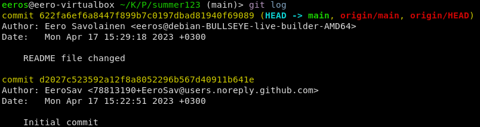

# h3 Git

## a) Online. Tee uusi varasto GitHubiin (tai Gitlabiin tai mihin vain vastaavaan palveluun). Varaston nimessä ja lyhyessä kuvauksessa tulee olla sana "summer". Aiemmin tehty varasto ei kelpaa. (Muista tehdä varastoon tiedostoja luomisvaiheessa, esim README.md ja GNU General Public License 3)

Tein uuden repositoryn githubiin, laitoin nimeksi summer123 ja kuvaukseksi summer repository.

Asetin repositoryn yksityiseksi, lisäsin README tiedoston ja lisenssiksi valitsin GNU General Public V3 Lisenssin 

Painoin vihreää Create repository nappia.

## b) Dolly. Kloonaa edellisessä kohdassa tehty uusi varasto itsellesi, tee muutoksia, puske ne palvelimelle, ja näytä, että ne ilmestyvät weppiliittymään.

kopioin repositoryn kloonauskohdasta löytyvällä ssh linkillä. olin jo aiemmin lisännyt ssh avaimen githubiin

`git clone git@github.com:EeroSav/summer123.git`

## c) Doh! Tee tyhmä muutos gittiin, älä tee commit:tia. Tuhoa huonot muutokset ‘git reset --hard’. Huomaa, että tässä toiminnossa ei ole peruutusnappia.

muokkasin README.md tiedostoa microlla

lisäsin muutokset gittiin, en pullannut repositorya alussa koska tiesin ettei siellä ollut muutoksia

		git add .
		git commit -m "README file changed"
		git push origin main

		

## d) Tukki. Tarkastele ja selitä varastosi lokia. Tarkista, että nimesi ja sähköpostiosoitteesi näkyy haluamallasi tavalla ja korjaa tarvittaessa.

muokkasin vielä Author sähköpostin vastaavaan oikeita tietoja

git config --local user.email "eero.sav@gmail.com"

poistin README ja committasin

nyt log näyttää tältä

