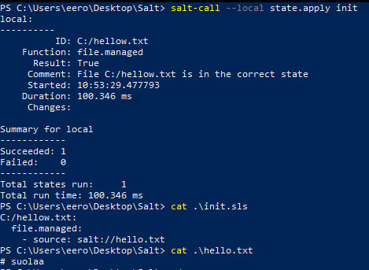
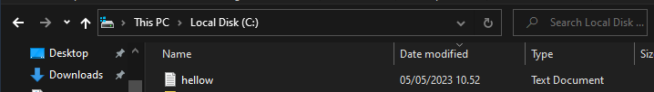
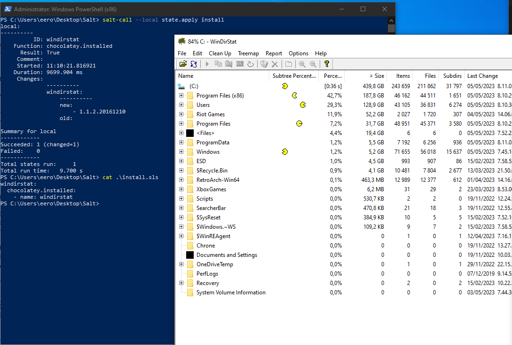

## x) Lue ja tiivistä. (Tässä x-alakohdassa ei tarvitse tehdä testejä tietokoneella, vain lukeminen tai kuunteleminen ja tiivistelmä riittää. Tiivistämiseen riittää muutama ranskalainen viiva. Huomaa, että osa artikkeleista on luonteeltaan raportteja tai muistiinpanoja, eli vähemmän valmiita kuin testatut ja siivotut ohjeet. Keskity kohtiin, joita voisit itse kokeilla tai hyödyntää)

[Karvinen 2018: Control Windows with Salt](https://terokarvinen.com/2018/control-windows-with-salt/)

- Windows komentokehote parantunut, mutta silti suuri ongelma on paketinhallinnan puuttuminen.

- Masterin salt version täytyy olla uudempi kuin minion

- voidaan ajaa paikallisesti `salt-call --local` testinä

[Harjoitus 6 - Windows 10.05.2021 - Johan Lindell](https://johanlindell.fi/palvelintenhallinta#h6)

ladataan windowsille salt minion

master ip or hostname saadaan terminaalista `hostname -i`

minion nimi vapaa mutta tunnistettava

asennetaan salt master `sudo apt-get install salt-master`

hyväksytään avaimet ja tarkistetaan: `sudo salt '*' cmd.run 'whoami'`

## a) Asenna Salt Windowsille

ympäristö: tavoitteena asentaa salt minion windows10 joka on pöytäkoneeni pääkäyttöjärjestelmä ja master Debian wsl jonka olen aiemmin asentanut.

latasin saltin minionin saltin sivujen windows [asennusohjeesta](https://docs.saltproject.io/salt/install-guide/en/latest/topics/install-by-operating-system/windows.html) löytyvästä linkistä

install file nimi: `https://repo.saltproject.io/salt/py3/windows/latest/Salt-Minion-3006.0-Py3-AMD64-Setup.exe`

asennus, ajoin .exe tiedoston, next -> agree -> path(default): C:\Program Files\Salt Project\Salt -> next

master ip kohdalle tulos: hostname -i wsl

install

Start salt minion[X], finish

master asennus wsl `sudo apt install salt-master`, jokin meni pieleen joten ajoin ensin `sudo apt-get update` ja `sudo apt-get upgrade`

kokeilin ajaa `salt-call --local test.ping` mutta se ei toiminut (kuvassa oikealla), käytin terminal sovelluksen powershelliä joten kokeilin ajaa sen oikeassa powershellissä pääkäyttäjän oikeuksilla

tämä olikin b tehtävässä hyvin ohjeistettu

## b) Ei voi kalastaa. Käytä Windowsilla Salttia paikallisesti ilman verkkoa (Ruma-X, powershell as admin, salt-call --local state.single ...)

		PS C:\WINDOWS\system32> salt-call --local cmd.run whoami
		local:
		    desktop-58omb0e\eero

		PS C:\WINDOWS\system32> salt-call --local state.single file.managed C:/Users/eero/salted.txt
		[WARNING ] State for file: C:/Users/eero/salted.txt - Neither 'source' nor 'contents' nor 'contents_pillar' nor 'contents_grains' was defined, yet 'replace' was set to 'True'. As there is no source to replace the file with, 'replace' has been set to 'False' to avoid reading the file unnecessarily.
		local:
		----------
		          ID: C:/Users/eero/salted.txt
		    Function: file.managed
		      Result: True
		     Comment: Empty file
		     Started: 21:24:22.217483
		    Duration: 95.256 ms
		     Changes:
		              ----------
		              new:
		                  file C:/Users/eero/salted.txt created
		
		Summary for local
		------------
		Succeeded: 1 (changed=1)
		Failed:    0
		------------
		Total states run:     1
		Total run time:  95.256 ms
		PS C:\WINDOWS\system32>

		PS C:\Users\eero> ls
		
		
		    Directory: C:\Users\eero
		
		
		Mode                 LastWriteTime         Length Name
		----                 -------------         ------ ----
		-a----          5/3/2023   9:24 PM              0 salted.txt

poistin tulosteesta epäolennaiset tiedostot pois jälkeenpäin, oikea tiedosto ja pituus 0 koska sisältöä ei ole lisätty.

## c) Hei ikkuna! Tee hei maailma Windowsin Saltille. Voit vaikkapa tehdä tyhjän tiedoston johonkin väliaikaistiedostojen kansioon. Käytä idempotentteja komentoja, esim file.managed.

Koin saman ongelman kuin ystäväni Miki Suominen hänen [raportissaan](https://github.com/RAV64/palvelinten-hallinta/blob/main/h5.md)

kävin lisäämässä C:\ProgramData\Salt Project\Salt\conf kansion minion konfiguraatiotiedostoon polun Desktop/Salt kansioon tämän jälkeen init toimi..

## d) Installed. Asenna Windowsille ohjelma Saltilla. (Voit käyttää eri vaihtoehtoja: kopioida binäärin suoraan sopivaan kansioon, pkg.installed ja choco, pkg.installed ja salt winrepo).

asensin windirstatin chocolatey paketinhallintaohjelman avulla.

